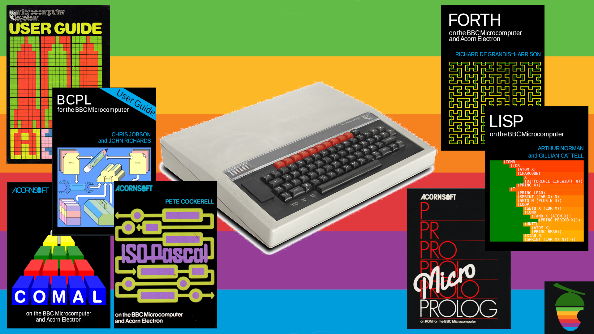

# Applecorn


Applecorn is a ProDOS application for the Apple //e Enhanced which provides
an environment for Acorn BBC Microcomputer language ROMs to run.  This
allows BBC BASIC and other Acorn languages to run on the Apple //e and
compatible systems.

The language ROMs run as-is, without any modification required.

## Hardware Requirements

The minimum requirement for Applecorn is an Apple II system with 128KB
of memory and a 65C02 processor.  This includes the following:

- Apple //e Enhanced (but not the original \]\[e, which has a 6502.)
- Apple //c and //c+
- Apple IIgs
  - You must enable the Alt Text Mode CDA!
  - ROM1: Only the 40 column modes `MODE 6` and `MODE 7` can be used.
    (This is because the ROM1 GS is unable to shadow PAGE2 80 column.)
  - ROM3: You may also use the 80 column `MODE 3`.  (Apple fixed the
    PAGE2 shadowing problem in ROM3. You do still need to run the Alt
    text mode CDA however.)

## How to Run the Software

Boot the diskette `applecorn.po` which is an 800KB bootable ProDOS
diskette.  I use version 2.4.2 of ProDOS for my testing, but the software
should run on other versions of ProDOS.

Run `BASIC.SYSTEM` and at the Applesoft BASIC prompt type:
```
BRUN APPLECORN
```
to start the software.  Alternatively, you can simply select `APPLECORN`
in the ProDOS 2.4.2 Bitsy Bye file browser.

When first started, Applecorn will display a ROM selection menu.  Choose
the language ROM you wish to load by pressing the associated number key.
Applecorn will then load the requested ROM file from the diskette.  Each
of these files is a dump of a 16KB BBC Micro language ROM.

Once the ROM has loaded, it will automatically be started and you will
see the prompt.  For BBC BASIC, the prompt character is `>`.

Most of the BBC Micro languages (including BBC BASIC) prefer upper case
input.  You may want to keep Caps Lock enabled most of the time!

32 Kilobytes of space is available for your programs and variables. `PAGE`
is set to `&0E0`.

## 'Applecorn MOS' Features

### Compatible ROMs
- In principle any Acorn language ROM should work.
- Currently I have verified operation with:
  - BBC BASIC
  - Acornsoft COMAL
  - Acornsoft FORTH
  - Acornsoft Lisp
  - Acornsoft MicroProlog
  - Acornsoft BCPL
- I have not yet investigated two-ROM languages such as Logo or
  ISO Pascal.  It may be possible to support these also.



### Video Modes

Two text video modes and one graphics mode are currently supported:
- `MODE 6` and `MODE 7` - 40x24 text (in mode 7, chars $80 to $9F are converted
  to spaces)
- `MODE 3` - 80x24 text.
- `MODE 2` - Apple II high resolution mode.  The physical resolution is 280x192
  pixels.  This is mapped onto the normal BBC Micro 1280x1024 virtual resolution,
  with the origin at the bottom left of the screen.

_NOTE:_ You can set the startup video mode by holding down the appropriate number
key while Applecorn starting (while it is loading the ROM file.)

Andy McFadden's [FDraw library](https://github.com/fadden/fdraw) is used for 
efficient high resolution line and point plotting.

### Escape Key

The BBC Micro uses interrupts extensively and the Escape key is handled
asynchronously.  The language ROM code simply checks an 'escape flag' in
zero page ($FF) from time to time to detect if Escape has been pressed.

The Apple //e does not use interrupts in its keyboard handling and the basic
machine include no sources of interrupts at all (there is no system timer.)
This prevents Escape from being handled in the same manner.

As a partial workaround, Applecorn checks whether the Escape key is pressed
from time to time when it has control, but there are cases where a program
can run forever without ever making a MOS call.  In these cases the only
way to interrupt the program is to press Ctrl-Reset.

### Ctrl-Reset

The Ctrl-Reset key combination is the only asynchronously handled keyboard
event on the Apple //e.  Applecorn sets up a reset handler which will restart
the ROM after Ctrl-Reset.  Any user program in aux memory will be untouched.

For ROMs such as BASIC or COMAL, the `OLD` command can be used to recover the
program in memory.

### Special VDU Features

- `Ctrl-S` will pause the screen and `Ctrl-Q` will resume scrolling.
- The BBC Micro 'Copy Editor' function is supported.  Use the Apple II
  cursor keys to move the copy cursor and the `Tab` key to copy a character
  from the copy cursor to the insert cursor.
- BBC Micro function keys are supported.  Use Open Apple with the number
  keys for the unshifted function keys.

### HostFS

Applecorn's HostFS uses the ProDOS MLI to service all Acorn MOS filesystem
calls.  This means that Applecorn works directly with ProDOS volumes, such
as floppy disks, mass storage devices and even network connected drives
using ADT's VEDrive.

#### HostFS Pathnames

Pathnames used within Applecorn are regular ProDOS paths.  The
directory separator is forward slash `/` and every ProDOS filesystem has
a volume name which is used to access the top level ('volume') directory.
For example, a volume with the name 'TEST' would be mounted under ProDOS
as `/TEST`.

Applecorn adds a few extra features to ProDOS paths, as follows:
- A notation is provided for physical drive numbers, identifed by slot (1-7)
and drive (0 or 1).  This is very useful when you insert a floppy disk
with an unknown volume name.  The syntax for physical device specifiers
is a colon followed by two digits - one for the slot number and the other
for the drive number.  So, for example, `:61` would refer to slot 6,
drive 1.  Applecorn uses the ProDOS `ON_LINE` MLI call to find the 
volume associated with the physical device.  If slot 6, drive 1, contains
the volume 'FLOPPY', then a path `:S61/TESTFILE` will be converted to
`/FLOPPY/TESTFILE`.
- It is possible to refer to the current working directory (current prefix
in ProDOS terms) using `.` (like Linux or Windows) or `@` (like BBC ADFS.)
The current working directory notation is only supported at the beginning
of pathnames.
- Support is provided for easily accessing the parent directory.  This
may be denoted using `..` (like Linux or Windows) or `^` (like BBC ADFS.)
The parent directory notation is only supported at the beginning of
pathnames, but it may be applied multiple times to navigate further up
the tree.
- Some examples:
   - `/H1/APPLECORN` - absolute path
   - `APPLECORN` - relative path
   - `./APPLECORN` - relative path (explicit)
   - `^` - parent dir
   - `..` - parent dir (alternate form)
   - `^/^` - up two levels
   - `../..` - up two levels (alternate form)
   - `^/MYSTUFF` - file or directory in parent
   - `../MYSTUFF` - alternative way to refer to sibling directory
- Since Acorn's DFS allows filenames beginning with a digit, while ProDOS
requires names to begin with an alphabetic character, Applecorn prefixes
any file or directory names beginning with a digit with the letter 'N'.
An Applecorn path such as `/FOO/0DIR/50DIR/FILE01` would be converted to
`/FOO/N0DIR/N50DIR/FILE01`, for example, in order to make it a legal
ProDOS path.

#### HostFS Wildcards

Applecorn HostFS provides support for wildcards.  The following wildcard
characters are used:
   - `#` or `?` - matches any single character
   - `*` - matches zero or more characters

The HostFS tries to follow the same conventions as Acorn's ADFS, which 
allows wildcards to be used in some cases to abbreviate long pathnames
and in others to specify a list of files to operate on at once.

Like ADFS, HostFS commands accept several different types of file argument.
Following Acorn's convention, these may be described as follows:
   - `<obspec>` is an 'object specification'.  This is a pathname without
     any wildcard characters, as described in the previous section.
   - `<*obspec*>` is an 'wildcard object specification'.  This is a
     pathname which may include the wildcard characters.  If the
     wildcard characters specified result in multiple matching objects,
     the first one is used.
   - `<listspec>` is an 'list specification'.  This is also a
     pathname which may include the wildcard characters.  However, if the
     wildcard results in multiple matches, the command will operate
     on all of these files.
   - `<dry>` is a drive number.  (For example, `:61`).

Wildcards are expanded wherever they appear in the path with one
exception.  For non-leaf nodes, the first match will be always be 
substituted.  In the case of `<*objspec*>` the first match for the leaf
node will always be used.  However for `<listspec>` all matches of the 
leaf node will be operated upon.

Examples: `:71/T*DIR/TEST??.TXT`, `*A*/FILES/C*/TEST*.TXT`

Wildcards may also be used for `OSFILE` and `OSFIND` system calls, so
BASIC command like `LOAD""`, `CHAIN""`, `OPENIN""` and `OPENUP""` can
use wildcards to specify the file to open.

The attentive reader will have noticed that I mention an exception to
wildcard matching.  Volume directory names are not currently subject
to wildcard search.  Either type them in full, or use the colon
notation to specify physical drive as an abbreviation.

### Star Commands

`*QUIT` - Terminate Applecorn and quit to ProDOS.  Because the 'BBC Micro'
lives in auxiliary memory, you can usually restart Applecorn by running it
again and recover your program with `OLD`.

`*HELP [topic]` - Prints out information similar to the same command on the BBC micro.
Specifically it lists the version of Applecorn MOS and the name of the current
language ROM.
  - `*HELP` shows the version number and the language ROM in use.
  - `*HELP MOS` shows the available MOS star commands.
  - `*HELP HOSTFS` shows the available HostFS star commands.

`*CAT [<*objspec*>]` (or `*. [*objspec*]`) - Simple listing of the files in the
specified directory, or the current working directory ('current prefix') if
no directory argument is given.

`*EX [<*objspec*>]` - Detailed listing of files in the current directory 
showing the load address, length and permissions.  `*EX` expects a directory
as an argument, for example `*EX :71/MYDIR`.

`*INFO [<listspec>]` - Displays the same detailed file listing as `*EX`,
but accepting a `<listspec>`.  `*INFO` expects a list of objects as an
argument, so `*INFO :71/MYDIR/*` would display the same info as the `*EX`
example above.

`*DIR <*objspec*>` - Allows the current directory to be changed to any ProDOS
path.  `*CD` and `*CHDIR` are synonyms for `*DIR`.  The argument is expected
to be a directory.

`*LOAD <*objspec*> SSSS` - Load file `<*objspec*>` into memory at hex address
`SSSS`. If the address `SSSS` is omitted then the file is loaded to the
address stored in its aux filetype.

`*SAVE <objspec> SSSS EEEE` - Save memory from hex address `SSSS` to hex
address `EEEE` into file `<objspec>`.  The start address `SSSS` is
recorded in the aux filetype.  (Note, no wildcards when saving.)

`*RUN <*objspec*>` - Load file `filepath` into memory at the address stored
in its aux filetype and jump to to it.  This is used for loading and
starting machine code programs.  You can also simply do `*<*objspec*>` or
`*/<*objspec*>` (the latter form is useful if the name is the same as that
of a ROM routine.)

`*DELETE <objspec>` - Delete file `<objspec>` from disk.  This command
can also delete directories, provided they are empty.  No wildcards are
allowed.

`*DESTROY <listspec>` - Deletes multiple files as specified by
`<listspec>`. For example, `*DESTROY PROJECT/*.ASM`.

`*RENAME <objspec1> <objspec2>` - Rename file or directory `<objspec1>`
to `<objspec2>`.  No wildcards are allowed.

`*DRIVE <dry>` - Switch to the specified physical drive.  This is equivalent
to using `*DIR` but does not allow subdirectories to be specified.  The
working directory will be set to the volume directory corresponding to
the physical device specified.

`*FREE <dry>` - Shows blocks used and blocks free on the specified physical
device.

`*CDIR <objspec>` - create directory `dirname`.  `*MKDIR` is a synonym.

`*ACCESS <listspec> attribs` - change file permisions.  The string `attribs`
can contain any of the following:
  - `R` - File is readable
  - `W` - File is writeable
  - `L` - File is locked against deletion, renaming and writing.
For example: `*ACCESS *.ASM WR`

`*COPY <listspec> <*objspec*>` - Copy file(s).  There are two forms of
the `*COPY` command:
  - `*COPY <objspec> <*objspec*>` - Copy a single file.  The first argument
    must refer to a file and the second can be a file or a directory.
    If the target file exists and is writeable it will be overwritten.
    If a directory is specified as the destination then the file will
    be copied into the directory using the same filename.  No wildcards
    are allowed in the source filename in this case.  An example of
    this type of usage is `*COPY TEXT/ABC.TXT ../BACKUPS/ABC.BACKUP.TXT`
  - `*COPY <listspec> <*objspec*>` - Copy multiple files.  The first
    argument refers to a list of files, specified using wildcards.  The
    second argument must refer to a directory.  All the files included
    in the wildcard pattern will be copied into the destination
    directory.  For example of copying multiple files is 
    `*COPY :71/DOCS/*.TXT :72/TEXTDIR`
  - Recall that `@` or `.` may be used to specify the current working
    directory, while `^` or `..` may be used to specify the parent
    directory.

`*FX a[,x,y]` - invokes `OSBYTE` MOS calls.

`*OPT` - sets file system options.  `*OPT 255,x` may be used to enable or
disable debugging output.

## How to Build

Applecorn is built natively on the Apple //e using the Merlin 16 assembler
v3.53 (requires a 65816 though.)  It may also be built using Merlin-32 on
Windows, Linux or Mac if preferred.  The code should also assemble on
Merlin-8 2.58 provided some of the longer comments are trimmed (Merlin-16
allows longer lines.)

In Merlin-16 (Merlin-8 in parenthesis, where different):
- Press `D` for disk commands and enter the prefix of the build directory:
  `PFX /APPLECORN`
- Press `L` to load a file and enter the filename `APPLECORN`.
- Merlin will enter the editor automatically (or press `E`).  Open Apple-A
  starts assembly. (Merlin-8: Issue the following command a the editor's
  `:` prompt: `asm`
- Once assembly is complete, enter the command `q` to quit the editor.
- Press `Q` to quit Merlin.

## Theory of Operation

### BBC Micro 

On the BBC Micro, language ROMs have a very clean interface to the Machine
Operating System (MOS).  Syscalls are used for all accesses to the hardware,
rather than poking at memory mapped addresses directly, as is common in
other 6502 systems.  This was done partly to enable programs to run on a 
second processor connected to the main BBC Micro over an interprocessor
interface called The Tube.

On the BBC Micro, the 64K address space looks like this:

```
                 +----------------------+ $ffff
                 |                      |
                 | MOS ROM (16KB)       |
                 |                      |
                 +----------------------+ $c000
                 |                      |
                 | Language ROM (16KB)  |
                 |                      |
                 +----------------------+ $8000
                 |                      |
                 | User RAM (32K)       |
                 |                      |
                 |                      |
                 |                      |
                 |                      |
                 |//////////////////////|
                 +----------------------+ $0000
```
The hatched area at the bottom represents reserved space such as zero page,
the stack and pages two through seven which are used by the language ROM for
various purposes.

Display memory on the BBC Micro is allocated at the top of user RAM, from
$8000 down.  Higher resolution modes use more memory, reducing the user RAM
available for BASIC programs.

The BBC Micro uses a unique paging mechanism referred to as 'Sideways ROM',
which allows up to 16 language and filing system ROMs to be banked into the
16KB space from $8000 to $bfff.

### Apple //e

The Apple //e, with 128KB has two 64KB banks of memory.  The main memory bank
is as follows:
```
   +----------------------+ $ffff +----------------------+
   | BASIC/Monitor ROM    |       | Language Card        |
   |                      |       |                      | +-4K Bank Two----+
   |###I/O Space (4KB)####|       +----------------------+ +----------------+
   +----------------------+ $c000
   |                      |
   |                      |
   |                      |
   |                      |
   |                      |
   | User RAM (48K)       |
   |                      |
   |                      |
   |                      |
   |                      |
   |//////////////////////|
   +----------------------+ $0000
```
Here there is 48KB of RAM rather than 32KB, and the total ROM is just 12KB,
starting at $d000.  The 4KB from $c000 to $cfff is all memory mapped I/O.

An additional 16KB of memory is available, which is referred to as the
Language Card (LC henceforth.)  This memory can be banked into the space
where the ROM usually resides from $d000 up.  Note that this address space
is only 12KB so the 16KB LC memory is itself banked with the bottom 4KB of
LC space having two banks.

When an Extended 80 Column card is installed in the aux slot of the Apple
//e, an additional 64KB of RAM is added, for a total of 128KB.  The entire
arrangement described above is duplicated, so there is 64KB of main memory
(divided between the 'lower 48K' and 16KB of LC memory) and 64KB of
auxiliary memory (divided in exactly the same manner.)

The Apple //e has softswitches to select whether to address the main or aux
bank for the main portion of RAM (ie: the 48KB up to $bfff).  Reading and
writing may be switched separately so it is possible to execute code and
read data from one bank while writing to the other.  A separate softswitch
controls whether zero page, the stack, and LC memory addresses will be passed
to main or aux banks.

The ProDOS operating system resides primarily in the main bank Language
Card memory, so this memory is not available to Applecorn if we wish to
retain the facilties provided by ProDOS.

The Apple //e screen normally resides from $400 to $7ff in main memory (for
40 column mode) or at $400 to $7ff in both main and aux memory (for 80
column mode.)  There is a softswitch to switch to text page two from $800
to $bff.

### Applecorn Architecture

```
MAIN BANK:

   +----------------------+ $ffff +----------------------+
   | BASIC/Monitor ROM    |       | Language Card        |
   |                      |       | ProDOS               | +-4K Bank Two----+
   |###I/O Space (4KB)####|       +----------------------+ +-Unused---------+
   +----------------------+ $c000
   |                      |
   |                      |
   |                      |
   |                      |
   | Applecorn loader &   |
   | Applecorn code to    |
   | interface with       |
   | ProDOS               |
   |                      |
   |                      |
   |//////////////////////|
   +----------------------+ $0000

AUX BANK:

   +----------------------+ $ffff 
   | Language Card        |
   | Applecorn MOS        |       +-4K Bank Two----+
   |###I/O Space (4KB)####|       +-Unused---------+
   +----------------------+ $c000
   |                      |
   | Acorn Language ROM   |
   |                      |
   +----------------------+
   |                      |
   | Acorn language       |
   | user code/data       |
   | space                |
   |                      |
   |                      |
   |//////////////////////|
   +----------------------+ $0000
```

- Applecorn maintains a 'BBC Micro virtual machine' in the Apple //e auxiliary
  memory. In particular, the 'BBC Micro' has its own zero page and stack in
  auxiliary memory, so there is no contention with ProDOS or with Applecorn.
- Applecorn primarily uses the main memory for servicing ProDOS file system
  requests for the 'BBC Micro virtual machine'.
- The Acorn language ROM is loaded to $8000 in aux memory.
- The Language Card memory is enabled and used to store the 'Applecorn MOS'
  from $d000 up in aux memory.  (The main bank LC memory contains ProDOS.)
- Applecorn copies its own 'Applecorn MOS' code to $d000 in aux memory and
  relocates the MOS entry vectors to high memory.
- An 80 column screen is configured using PAGE2 memory from $800 to $bff
  in both main and aux memory.  This conveniently just fits in above page 7,
  which is the highest page used as Acorn language ROM workspace.
- The only real difference between the Apple //e aux memory map and that of
  the BBC Micro is the Apple //e has a 'hole' from $c000 to $cfff where memory
  mapped I/O resides.  Fortunately this does not really matter because the 
  language only uses well-defined entry points to call into the MOS, so we
  can simply avoid this address range.
- The memory map for the main and aux banks is illustrated in the diagram
  above.  For the aux bank, the LC is always banked in since no Apple monitor
  or BASIC ROM routines are called, so this is omitted from the diagram.

## Limitations

Applecorn currently has the following limitations:
- Not all MOS calls are implemented.
- There is file I/O support for file-orientated (`OSFILE`) file
  operations.  This allows `LOAD` and `SAVE` to work in languages such as
  BASIC or COMAL.
- There is also support for the character orientated operations (`OSFIND`,
  `OSBGET` `OSBPUT`) which allows all the disk file operations in the Acorn
  languages to work correctly.  For example in BBC BASIC the following
  commands work: `OPENIN`, `OPENOUT`, `OPENUP`, `BGET#` `BPUT#` `PTR#=`,
  `EOF#`, `EXT#`.
- The VDU driver is quite primitive at present.  Is supports 80 column
  text mode (`MODE 0`) and 40 column text mode (`MODE 1`).  There is
  currently no graphics support.
- Only a limited number of `OSBYTE` and `OSWORD` calls are implemented.
  More will be added in due course.
- Special BBC Micro functions such as sound, A/D interfaces, programmable
  function keys and so on are currently not supported.
- The Applecorn MOS command line is currently quite limited.  More commands
  will be added in due course.


